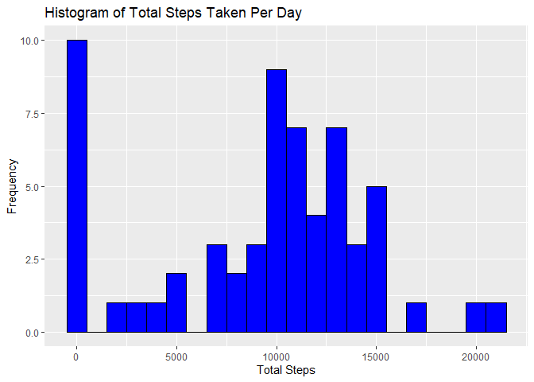
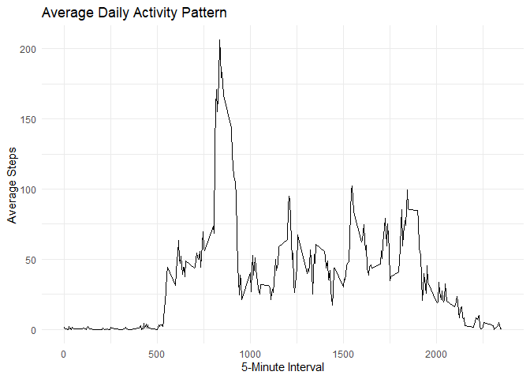
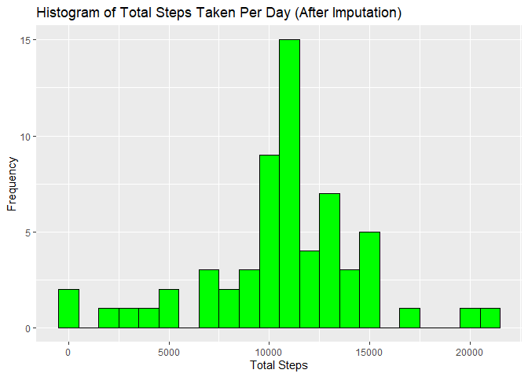
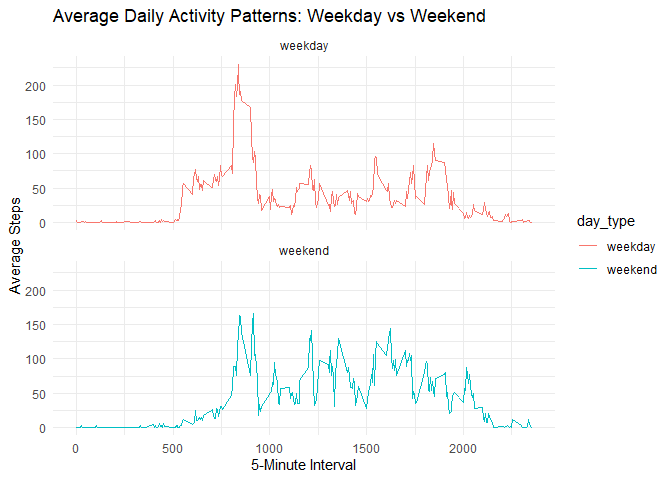

``` r
library(dplyr)
```

```
## 
## Attaching package: 'dplyr'
```

```
## The following objects are masked from 'package:stats':
## 
##     filter, lag
```

```
## The following objects are masked from 'package:base':
## 
##     intersect, setdiff, setequal, union
```

``` r
library(ggplot2)
## Loading and preprocessing the data
data <- read.csv("activity.csv")


## What is mean total number of steps taken per day?
total_steps_per_day <- data %>%
  group_by(date) %>%
  summarize(total_steps = sum(steps, na.rm = TRUE))
  
# Create a histogram of the total number of steps per day
ggplot(total_steps_per_day, aes(x = total_steps)) +
  geom_histogram(binwidth = 1000, fill = "blue", color = "black") +
  labs(title = "Histogram of Total Steps Taken Per Day", x = "Total Steps", y = "Frequency")
```

<!-- -->

``` r
mean_steps <- mean(total_steps_per_day$total_steps)
median_steps <- median(total_steps_per_day$total_steps)


mean_steps
```

```
## [1] 9354.23
```

``` r
median_steps
```

```
## [1] 10395
```

``` r
## What is the average daily activity pattern?
avg_steps_per_interval <- data %>%
  group_by(interval) %>%
  summarize(avg_steps = mean(steps, na.rm = TRUE))
  
ggplot(avg_steps_per_interval, aes(x = interval, y = avg_steps)) +
  geom_line() +
  labs(title = "Average Daily Activity Pattern", x = "5-Minute Interval", y = "Average Steps") +
  theme_minimal()
```

<!-- -->

``` r
max_interval <- avg_steps_per_interval[which.max(avg_steps_per_interval$avg_steps), ]

max_interval
```

```
## # A tibble: 1 × 2
##   interval avg_steps
##      <int>     <dbl>
## 1      835      206.
```

``` r
## Imputing missing values


total_missing <- sum(is.na(data$steps))

# Print the total number of missing values
print(paste("Total missing values: ", total_missing))
```

```
## [1] "Total missing values:  2304"
```

``` r
# Calculate the mean steps for each 5-minute interval
mean_steps_per_interval <- data %>%
  group_by(interval) %>%
  summarize(mean_steps = mean(steps, na.rm = TRUE))

# Impute missing values with the mean steps for the corresponding interval
data_imputed <- data %>%
  left_join(mean_steps_per_interval, by = "interval") %>%
  mutate(steps = ifelse(is.na(steps), mean_steps, steps)) %>%
  select(-mean_steps)  # Remove the temporary mean column

# Calculate the total number of steps per day after imputation
total_steps_imputed <- data_imputed %>%
  group_by(date) %>%
  summarize(total_steps = sum(steps))

# Create a histogram of the total number of steps per day after imputation
ggplot(total_steps_imputed, aes(x = total_steps)) +
  geom_histogram(binwidth = 1000, fill = "green", color = "black") +
  labs(title = "Histogram of Total Steps Taken Per Day (After Imputation)", x = "Total Steps", y = "Frequency")
```

<!-- -->

``` r
# Calculate the mean and median of the total steps per day after imputation
mean_steps_imputed <- mean(total_steps_imputed$total_steps)
median_steps_imputed <- median(total_steps_imputed$total_steps)

# Print the results
print(paste("Mean after imputation: ", mean_steps_imputed))
```

```
## [1] "Mean after imputation:  10766.1886792453"
```

``` r
print(paste("Median after imputation: ", median_steps_imputed))
```

```
## [1] "Median after imputation:  10766.1886792453"
```

``` r
## Are there differences in activity patterns between weekdays and weekends?


# Create a new factor variable for "weekday" or "weekend"
data_imputed$day_type <- ifelse(weekdays(as.Date(data_imputed$date)) %in% c("Saturday", "Sunday"), "weekend", "weekday")

# Calculate the average number of steps for each 5-minute interval, grouped by day_type (weekday or weekend)
avg_steps_by_day_type <- data_imputed %>%
  group_by(interval, day_type) %>%
  summarize(avg_steps = mean(steps, na.rm = TRUE))
```

```
## `summarise()` has grouped output by 'interval'. You can override using the
## `.groups` argument.
```

``` r
# Create a panel plot comparing weekday and weekend activity patterns
ggplot(avg_steps_by_day_type, aes(x = interval, y = avg_steps, color = day_type)) +
  geom_line() +
  facet_wrap(~ day_type, ncol = 1) +
  labs(title = "Average Daily Activity Patterns: Weekday vs Weekend", x = "5-Minute Interval", y = "Average Steps") +
  theme_minimal()
```

<!-- -->
